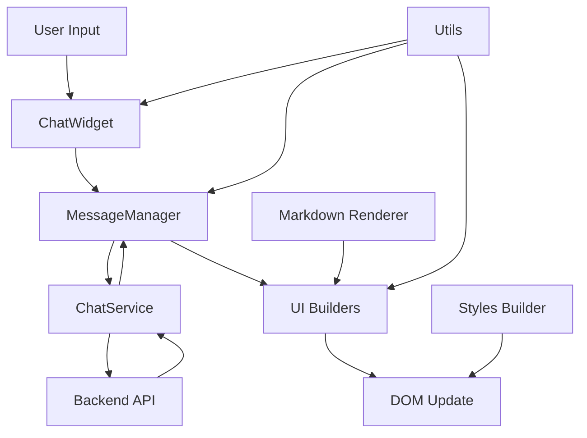

# Albert AI Chat Widget - Architektur Dokumentation

## Überblick

Das Albert AI Chat Widget wurde von einer monolithischen 4200+ Zeilen Datei in eine modulare, gut organisierte Codebasis refaktoriert. Diese Dokumentation beschreibt die neue Architektur und erklärt, wo sich welche Funktionalität befindet.

## Verzeichnisstruktur

```
src/
├── index.ts                 # Haupteinstiegspunkt und ChatWidget Klasse
├── types/                   # TypeScript Typdefinitionen
│   └── index.ts            # Alle Interfaces, Types und Enums
├── utils/                   # Utility-Funktionen
│   ├── index.ts            # Zentraler Export-Punkt für alle Utils
│   ├── html-utils.ts       # HTML-Escaping und Sanitization
│   ├── format-utils.ts     # Zeit-Formatierung und Parsing
│   ├── general-utils.ts    # Allgemeine Hilfsfunktionen
│   └── dom-utils.ts        # DOM-Manipulation und UI-Helfer
├── config/                  # Konfiguration
│   └── default-options.ts  # Standard-Konfigurationswerte
├── renderer/                # Rendering-Logik
│   └── markdown.ts         # Markdown-zu-HTML Konvertierung
├── styles/                  # Styling
│   └── builder.ts          # CSS-Generierung und Theme-Variablen
├── services/                # Backend-Kommunikation
│   └── chat-service.ts     # Chat API Service Layer
├── managers/                # State Management
│   └── message-manager.ts  # Nachrichten-Verwaltung
└── ui/                      # UI-Komponenten
    └── builders.ts         # DOM-Element Erstellungsfunktionen
```

## Module im Detail

### 1. **types/index.ts** - Typdefinitionen
Enthält alle TypeScript-Definitionen:
- `ChatRole`: Enum für Nutzer-/Agent-Rollen
- `ChatMessage`: Interface für Chat-Nachrichten
- `ChatWidgetOptions`: Hauptkonfigurationsinterface
- Service-bezogene Interfaces (Request/Response)
- UI-Element Referenzen
- Utility-Types wie `DeepPartial`

### 2. **utils/** - Utility-Funktionen

#### **html-utils.ts**
- `escapeHtml()`: XSS-sichere HTML-Escaping
- `sanitizeUrl()`: URL-Validierung und Sanitization
- `decodeHtmlEntities()`: HTML-Entity Dekodierung
- `renderPlainText()`: Text-zu-HTML Konvertierung

#### **format-utils.ts**
- `formatTime()`: Zeitstempel-Formatierung
- `parseTimestamp()`: String-zu-Date Parsing
- `parseElementArray()`: HTML-Element Array Parsing

#### **general-utils.ts**
- `deepMerge()`: Rekursives Object-Merging
- `clamp()`: Wert-Begrenzung
- `normalizeEndpoint()`: URL-Normalisierung
- `generateUniqueId()`: ID-Generierung
- `isSvgIcon()`: SVG-URL Erkennung

#### **dom-utils.ts**
- `createIconElement()`: Icon-Element Erstellung
- `scrollToBottom()`: Auto-Scroll Funktionalität
- `adjustTextareaHeight()`: Dynamische Textarea-Höhe
- `attachTypingCursor()`: Typing-Indicator Positionierung
- `findLastContentNode()`: DOM-Traversierung

### 3. **config/default-options.ts** - Konfiguration
Zentrale Stelle für alle Default-Werte:
- Standard-Texte und Labels
- Theme-Einstellungen
- Service-Konfiguration
- UI-Dimensionen
- Feature-Flags

### 4. **renderer/markdown.ts** - Markdown Rendering
Sichere Markdown-zu-HTML Konvertierung:
- `SafeMarkdownRenderer`: Custom marked.js Renderer
- `renderMarkdown()`: Haupt-Rendering-Funktion
- XSS-Schutz durch HTML-Escaping
- Code-Highlighting Unterstützung
- Link-Sanitization

### 5. **styles/builder.ts** - CSS Generierung
Dynamische Stylesheet-Erstellung:
- `buildStyles()`: Generiert komplettes CSS
- `generateThemeVariables()`: CSS Custom Properties
- Responsive Design Regeln
- Animations-Definitionen
- Shadow DOM kompatibles Styling

### 6. **services/chat-service.ts** - Backend Service
API-Kommunikation und Session-Management:
- `ChatService` Klasse mit:
  - `initSession()`: Session-Initialisierung
  - `sendMessage()`: Nachrichten senden
  - `fetchInfo()`: Historie abrufen
  - `fetchHistory()`: Vollständige Historie
- Session-ID Persistierung (localStorage)
- Polling-Mechanismus für Updates
- Fehlerbehandlung und Retry-Logik

### 7. **managers/message-manager.ts** - State Management
Zentrale Nachrichtenverwaltung:
- `MessageManager` Klasse mit:
  - `addMessage()`: Nachricht hinzufügen
  - `updateMessage()`: Status aktualisieren
  - `removeMessage()`: Nachricht entfernen
  - `hydrateFromHistory()`: Historie laden
- Tool-Call Verwaltung
- DOM-Element Referenzen
- Nachrichtenstatus-Tracking

### 8. **ui/builders.ts** - UI Komponenten
Factory-Funktionen für UI-Elemente:
- `createHeader()`: Chat-Header mit Buttons
- `createInputArea()`: Eingabebereich
- `createMessageElement()`: Nachrichtenblasen
- `createConsentPrompt()`: Datenschutz-Dialog
- `createToolActivityIndicator()`: Tool-Status
- `createLauncherButton()`: Widget-Öffner
- `createTeaserBubble()`: Teaser-Animation
- `createFooterLinks()`: Footer-Navigation
- `createDisclaimer()`: Disclaimer-Text

### 9. **index.ts** - Hauptmodul
Orchestrierung aller Module:
- `ChatWidget` Klasse:
  - Lifecycle-Management (mount/destroy)
  - Event-Handling
  - State-Koordination
  - UI-Updates
  - Service-Integration
- `init()`: Convenience-Funktion
- Modul-Exports für externe Nutzung

## Datenfluss



## Verwendungsbeispiel

```typescript
import { init } from './index';

// Widget mit Custom-Konfiguration initialisieren
const widget = init({
  theme: {
    primaryColor: '#007bff',
    borderRadius: 8
  },
  texts: {
    headerTitle: 'Support Chat',
    initialMessage: 'Wie kann ich Ihnen helfen?'
  },
  serviceConfig: {
    endpoint: 'https://api.example.com/chat',
    headers: {
      'Authorization': 'Bearer token'
    }
  }
});

// Widget öffnen
widget.open();

// Widget zerstören
widget.destroy();
```

## Build-Prozess

```bash
# TypeScript kompilieren
npm run build

# Entwicklungsmodus mit Watch
npm run dev

# Type-Checking
npm run lint

# Tests ausführen
npm test
```

## Vorteile der neuen Architektur

1. **Modularität**: Klare Trennung der Verantwortlichkeiten
2. **Wartbarkeit**: Einfacher zu verstehen und zu erweitern
3. **Testbarkeit**: Einzelne Module können isoliert getestet werden
4. **Wiederverwendbarkeit**: Utilities und Komponenten sind wiederverwendbar
5. **Type-Safety**: Zentrale Typdefinitionen
6. **Performance**: Kleinere Bundle-Größe durch Tree-Shaking
7. **Dokumentation**: Jedes Modul ist klar dokumentiert

## Migration von der alten Version

Die API bleibt vollständig kompatibel. Bestehende Integrationen funktionieren ohne Änderungen:

```javascript
// Alte Version (funktioniert weiterhin)
AlbertChat.init({ /* options */ });

// Neue Version (gleiche API)
AlbertChat.init({ /* options */ });
```

## Weiterentwicklung

Für neue Features:
1. Typen in `types/index.ts` definieren
2. Logik im passenden Modul implementieren
3. UI-Komponenten in `ui/builders.ts` erstellen
4. Integration in `ChatWidget` Klasse
5. Tests hinzufügen
6. Dokumentation aktualisieren